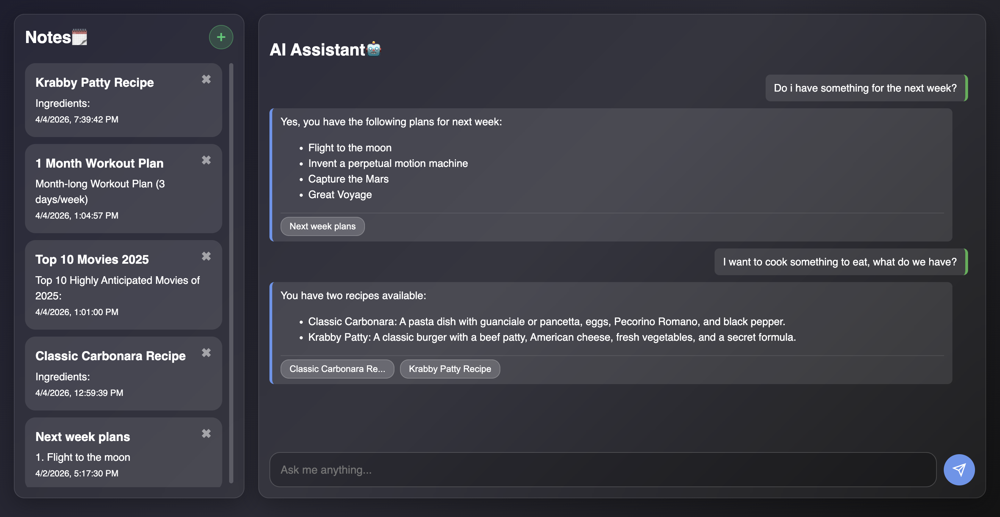
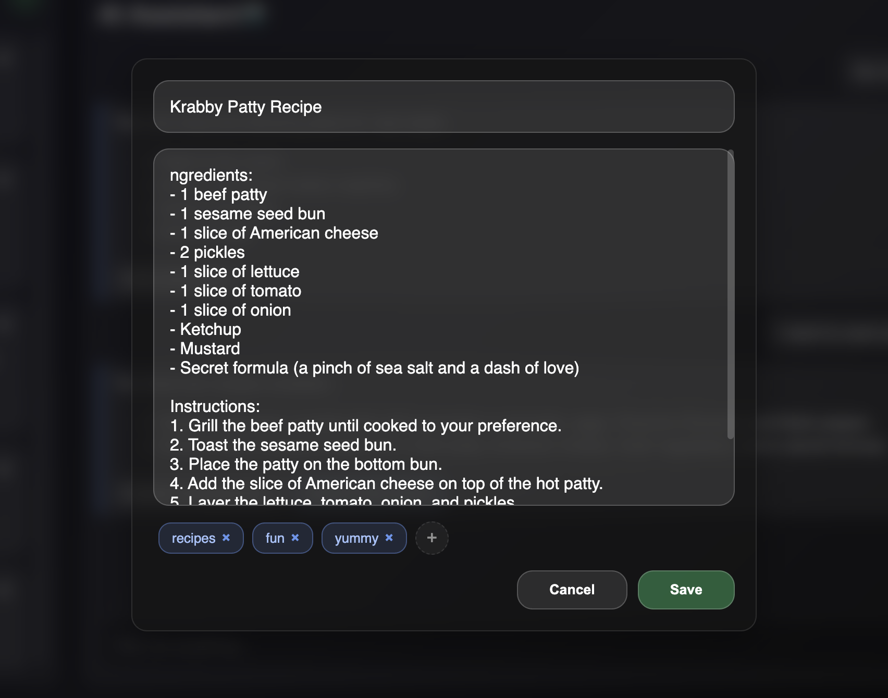

# AI Second Brain

An intelligent knowledge management system built with Node.js and PostgreSQL. It uses RAG (Retrieval-Augmented Generation) and semantic vector search to act as an extension of your own mind. 

### Key Capabilities
- **Semantic Retrieval (RAG):** Powered by `pgvector` and Google Gemini embeddings to find information based on context and meaning rather than keywords.
- **Dynamic Query Expansion:** Implements HyDE (Hypothetical Document Embeddings) logic to bridge the gap between user queries and stored knowledge.
- **Autonomous Note Capture:** An AI agent capable of identifying and saving critical insights from a conversation in real-time.
- **Modern UI:** Responsive, minimalist glassmorphism interface for focused knowledge work.

---

## Showcase

### Video Walkthrough

*A demonstration of the AI Agent autonomously creating and retrieving notes during a natural dialogue.*

### Screenshot Gallery
| Main Dashboard | Note Editor |
|---|---|
|  |  |

---

## Tech Stack
- **Backend:** Node.js, Express, TypeScript
- **Frontend:** Vanilla JavaScript (ES6+), HTML5, CSS3 (Glassmorphism)
- **Database:** PostgreSQL with `pgvector`
- **ORM:** Prisma
- **Models:** Google Gemini 1.5 Flash (Generation & Embeddings)

---

## Getting Started

### Prerequisites
- Node.js (v18+)
- PostgreSQL (with `pgvector` extension enabled)
- Google Gemini API Key

### Installation

1. **Clone the repository:**
   ```bash
   git clone https://github.com/NegativeOne36/AI_Second_Brain.git
   cd AI_Second_Brain
   ```

2. **Install dependencies:**
   ```bash
   npm install
   ```

3. **Configure environment:**
   Create a `.env` file in the root:
   ```env
   DATABASE_URL="your-postgresql-url"
   GEMINI_API_KEY="your-gemini-api-key"
   ```

4. **Initialize database:**
   ```bash
   npx prisma db push
   ```

5. **Start developing:**
   ```bash
   npm run dev
   ```

---

## Contact
Developed by [Your Name] – [Link to LinkedIn/Portfolio]
